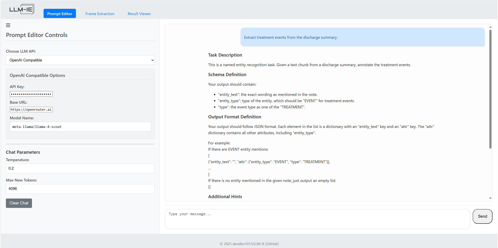
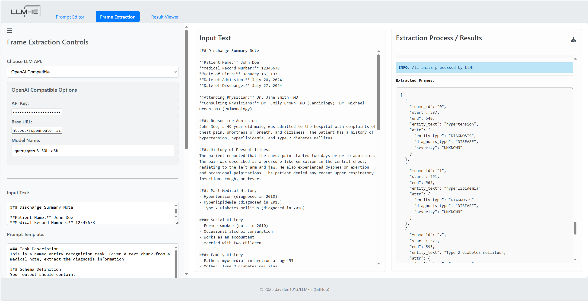

<div align="center"></div>


[](https://doi.org/10.1093/jamiaopen/ooaf012)
[](https://daviden1013.github.io/llm-ie/)

A comprehensive toolkit that provides building blocks for LLM-based named entity recognition, attribute extraction, and relation extraction pipelines. 

| Features | Support |
|----------|----------|
| **LLM Agent for prompt writing** | :white_check_mark: Web App, Interactive chat |
| **Named Entity Recognition (NER)** | :white_check_mark: Customizable granularity (e.g., sentence-level, document-level) |
| **Entity Attributes Extraction (AE)** | :white_check_mark: Flexible formats |
| **Relation Extraction (RE)** | :white_check_mark: Binary & Multiclass relations |
| **Visualization** | :white_check_mark: Web App, Built-in entity & relation visualization |

## 🆕Recent Updates
- [v1.0.0](https://github.com/daviden1013/llm-ie/releases/tag/v1.0.0) (May 15, 2025): 
  - 📐**User Guide** is now moved to [Documentation Page](https://daviden1013.github.io/llm-ie/)
  - **Web Application** provides drag-and-drop access to *LLM-IE*.
  - **Refactored `FrameExtractor`** by separating chunking methods (e.g., sentence) and prompting method (e.g., review). Chunking is now defined in `UnitChunker` and `ContextChunker`, while `FrameExtractor` defines prompting method. 
  - **Documentation website**. User guide and API reference is now available on []().
  - **Optimized concurrent/batch processing**. We adopt semaphore to better utilize the computation resource. 
- [v1.1.0](https://github.com/daviden1013/llm-ie/releases/tag/v1.1.0) (May 19, 2025): LLM-specific configuration to support reasoning models (o3, Qwen3).
- [v1.2.0](https://github.com/daviden1013/llm-ie/releases/tag/v1.2.0) (Jun 15, 2025): Attribute extractor for complicated attribute schema. 
- [v1.2.1](https://github.com/daviden1013/llm-ie/releases/tag/v1.2.1) (Jul 12, 2025): Added exporting/importing chat history functionality to the Prompt Editor.
- [v1.2.2](https://github.com/daviden1013/llm-ie/releases/tag/v1.2.2) (Aug 25, 2025): Added configs for reasoning LLMs (GPT-OSS, Qwen3).
- [v1.2.3](https://github.com/daviden1013/llm-ie/releases/tag/v1.2.3) (Oct 2, 2025): Separated vLLM inference engine support to `VLLMInferenceEngine`, OpenRouter support to `OpenRouterInferenceEngine`. 


## 📑Table of Contents
- [Overview](#overview)
- [Prerequisite](#prerequisite)
- [Installation](#installation)
- [Quick Start](#quick-start)
- [Web Applicaton](#web-application)
- [Examples](#examples)
- [Useful Scripts](#useful-scripts)
- [User Guide](#user-guide)
- [Benchmarks](#benchmarks)
- [Citation](#citation)

## ✨Overview
LLM-IE is a toolkit that provides robust information extraction utilities for named entity, entity attributes, and entity relation extraction. The flowchart below demonstrates the workflow starting from a casual language request to output visualization.

<div align="center"></div>

## 🚦Prerequisite
At least one LLM inference engine is required. There are built-in supports for 🚅 [LiteLLM](https://github.com/BerriAI/litellm), 🦙 [Llama-cpp-python](https://github.com/abetlen/llama-cpp-python),  [Ollama](https://github.com/ollama/ollama), 🤗 [Huggingface_hub](https://github.com/huggingface/huggingface_hub),  [OpenAI API](https://platform.openai.com/docs/api-reference/introduction), and  [vLLM](https://github.com/vllm-project/vllm). For installation guides, please refer to those projects. Other inference engines can be configured through the [InferenceEngine](src/llm_ie/engines.py) abstract class. See [LLM Inference Engine](#llm-inference-engine) section below.

## 💿Installation
The Python package is available on PyPI. 
```bash
pip install llm-ie 
```
Note that this package does not check LLM inference engine installation nor install them. See [prerequisite](#prerequisite) section for details. 

## 🚀Quick Start
We use a [synthesized medical note](demo/document/synthesized_note.txt) by ChatGPT to demo the information extraction process. Our task is to extract diagnosis names, spans, and corresponding attributes (i.e., diagnosis datetime, status).

### Choose an LLM inference engine
Choose one of the built-in engines below.

<details>
<summary>🚅 LiteLLM</summary>

```python
from llm_ie.engines import LiteLLMInferenceEngine

inference_engine = LiteLLMInferenceEngine(model="openai/Llama-3.3-70B-Instruct", base_url="http://localhost:8000/v1", api_key="EMPTY")
```
</details>

<details>
<summary> OpenAI API & Compatible Services </summary>

Follow the [Best Practices for API Key Safety](https://help.openai.com/en/articles/5112595-best-practices-for-api-key-safety) to set up API key.
```python
from llm_ie.engines import OpenAIInferenceEngine

inference_engine = OpenAIInferenceEngine(model="gpt-4o-mini")
```

For OpenAI compatible services (OpenRouter for example):
```python
from llm_ie.engines import OpenAIInferenceEngine

inference_engine = OpenAIInferenceEngine(base_url="https://openrouter.ai/api/v1", model="meta-llama/llama-4-scout")
```

</details>

<details>
<summary> Azure OpenAI API</summary>

Follow the [Azure AI Services Quickstart](https://learn.microsoft.com/en-us/azure/ai-services/openai/quickstart?tabs=command-line%2Ckeyless%2Ctypescript-keyless%2Cpython-new&pivots=programming-language-python) to set up Endpoint and API key.

```python
from llm_ie.engines import AzureOpenAIInferenceEngine

inference_engine = AzureOpenAIInferenceEngine(model="gpt-4o-mini", 
                                              api_version="<your api version>")
```

</details>

<details>
<summary>🤗 Huggingface_hub</summary>

```python
from llm_ie.engines import HuggingFaceHubInferenceEngine

inference_engine = HuggingFaceHubInferenceEngine(model="meta-llama/Meta-Llama-3-8B-Instruct")
```
</details>

<details>
<summary> Ollama</summary>

```python 
from llm_ie.engines import OllamaInferenceEngine

inference_engine = OllamaInferenceEngine(model_name="llama3.1:8b-instruct-q8_0")
```
</details>

<details>
<summary> vLLM</summary>

The vLLM support follows the [OpenAI Compatible Server](https://docs.vllm.ai/en/latest/serving/openai_compatible_server.html). For more parameters, please refer to the documentation.

Start the server
```cmd
vllm serve meta-llama/Meta-Llama-3.1-8B-Instruct
```
Define inference engine
```python
from llm_ie.engines import VLLMInferenceEngine
inference_engine = VLLMInferenceEngine(model="meta-llama/Meta-Llama-3.1-8B-Instruct")
```
</details>

<details>
<summary> SGLang</summary>

The SGLang support follows the [OpenAI APIs](https://docs.sglang.ai/basic_usage/openai_api_completions.html). For more parameters, please refer to the documentation.

Start the server
```cmd
CUDA_VISIBLE_DEVICES=<GPU#> python3 -m sglang.launch_server \
    --model-path meta-llama/Meta-Llama-3.1-8B-Instruct
```
Define inference engine
```python
from llm_ie.engines import SGLangInferenceEngine
inference_engine = SGLangInferenceEngine(model="meta-llama/Meta-Llama-3.1-8B-Instruct")
```
</details>

<details>
<summary>🦙 Llama-cpp-python</summary>

```python
from llm_ie.engines import LlamaCppInferenceEngine

inference_engine = LlamaCppInferenceEngine(repo_id="bullerwins/Meta-Llama-3.1-8B-Instruct-GGUF",
                                           gguf_filename="Meta-Llama-3.1-8B-Instruct-Q8_0.gguf")
```
</details>

In this quick start demo, we use vLLM to run *gpt-oss-120b* for prompt engineering and entity and attribute extraction.
The outputs might be slightly different with other inference engines, LLMs, or quantization. 

### Prompt engineering by chatting with LLM agent
Start the server in command line. Specify `--reasoning-parser openai_gptoss` to enable the reasoning parser. 
```cmd
vllm serve openai/gpt-oss-120b \
    --tensor-parallel-size 4 \
    --enable-prefix-caching \
    --reasoning-parser openai_gptoss
```

```python
from llm_ie import VLLMInferenceEngine, ReasoningLLMConfig, DirectFrameExtractor, PromptEditor, SentenceUnitChunker, SlideWindowContextChunker

# Define a LLM inference engine for the prompt editor
prompt_editor_llm = VLLMInferenceEngine(model="openai/gpt-oss-120b", 
                                        config=ReasoningLLMConfig(reasoning_effort="medium", 
                                                                  temperature=1.0, 
                                                                  top_p=1.0, 
                                                                  max_new_tokens=8192))
# Define LLM prompt editor
editor = PromptEditor(prompt_editor_llm, DirectFrameExtractor)
# Start chat
editor.chat()
```

This opens an interactive session:
<div align="left"></div>


The agent drafts a prompt template following the schema required by the ```DirectFrameExtractor```.
After a few rounds of chatting, we have a prompt template to start with:
```
### Task description
The paragraph below contains a clinical note with diagnoses listed. Please carefully review it and extract the diagnoses, including the diagnosis date and status.

### Schema definition
Your output should contain: 
    "entity_text" which is the diagnosis spelled as it appears in the text,
    "Date" which is the date when the diagnosis was made,
    "Status" which is the current status of the diagnosis (e.g. active, resolved, etc.)

### Output format definition
Your output should follow JSON format, for example:
[
    {"entity_text": "<Diagnosis>", "attr": {"Date": "<date in YYYY-MM-DD format>", "Status": "<status>"}},
    {"entity_text": "<Diagnosis>", "attr": {"Date": "<date in YYYY-MM-DD format>", "Status": "<status>"}}
]

### Additional hints
- Your output should be 100% based on the provided content. DO NOT output fake information.
- If there is no specific date or status, just omit those keys.

### Context
The text below is from the clinical note:
"{{input}}"
```

### Design prompting algorithm for information extraction
Instead of prompting LLMs with the entire document (which, by our experiments, has worse performance), we divide the input document into units (e.g., sentences, text lines, paragraphs). LLM only focus on one unit at a time, before moving to the next unit. This is achieved by the `UnitChunker` classes. In this demo, we use `SentenceUnitChunker` for sentence by sentence prompting. Though LLM only focus on one sentence at a time, we supply a context, in this case, a slide window of 2 sentences as context. This provides LLM with additional information. This is achieved by the `SlideWindowContextChunker` class. For information extraction, we use a lower reasoning effort (`reasoning_effort="low"`) for higher throughput. We set `temperature=1.0` and `top_p=1.0` to following the recommendation.

```python
# Load synthesized medical note
with open("./demo/document/synthesized_note.txt", 'r') as f:
    note_text = f.read()

# Define a LLM inference engine for the extractor
extractor_llm = VLLMInferenceEngine(model="openai/gpt-oss-120b", 
                                    config=ReasoningLLMConfig(reasoning_effort="low", 
                                                              temperature=1.0, 
                                                              top_p=1.0, 
                                                              max_new_tokens=8192))
# Define unit chunker. Prompts sentences-by-sentence.
unit_chunker = SentenceUnitChunker()
# Define context chunker. Provides context for units.
context_chunker = SlideWindowContextChunker(window_size=2)
# Define extractor
extractor = DirectFrameExtractor(inference_engine=extractor_llm, 
                                 unit_chunker=unit_chunker,
                                 context_chunker=context_chunker,
                                 prompt_template=prompt_template)
```

To run the frame extraction, use `extract_frames` method. A list of entities with attributes ("frames") will be returned. Concurrent processing is supported by setting `concurrent=True`.
```python
# To stream the extraction process, use concurrent=False, stream=True:
frames =  extractor.extract_frames(note_text, concurrent=False, verbose=True)
# For faster extraction, use concurrent=True to enable asynchronous prompting
# frames =  extractor.extract_frames(note_text, concurrent=True)

# Check extractions
for frame in frames:
    print(frame.to_dict())
```
The output is a list of frames. Each frame has a `entity_text`, `start`, `end`, and a dictionary of `attr`. 

```python
{'frame_id': '0', 'start': 537, 'end': 549, 'entity_text': 'hypertension', 'attr': {'Status': ''}}
{'frame_id': '1', 'start': 551, 'end': 565, 'entity_text': 'hyperlipidemia', 'attr': {'Status': ''}}
{'frame_id': '2', 'start': 571, 'end': 595, 'entity_text': 'Type 2 diabetes mellitus', 'attr': {'Status': ''}}
{'frame_id': '3', 'start': 991, 'end': 1003, 'entity_text': 'Hypertension', 'attr': {'Date': '2010', 'Status': None}}
{'frame_id': '4', 'start': 1026, 'end': 1040, 'entity_text': 'Hyperlipidemia', 'attr': {'Date': '2015', 'Status': None}}
{'frame_id': '5', 'start': 1063, 'end': 1087, 'entity_text': 'Type 2 Diabetes Mellitus', 'attr': {'Date': '2018', 'Status': None}}
{'frame_id': '6', 'start': 1646, 'end': 1682, 'entity_text': 'Jugular venous pressure not elevated', 'attr': {}}
{'frame_id': '7', 'start': 1703, 'end': 1767, 'entity_text': 'Clear to auscultation bilaterally, no wheezes, rales, or rhonchi', 'attr': {}}
{'frame_id': '8', 'start': 1802, 'end': 1823, 'entity_text': 'no hepatosplenomegaly', 'attr': {}}
{'frame_id': '9', 'start': 1926, 'end': 1962, 'entity_text': 'ST-segment depression in leads V4-V6', 'attr': {}}
{'frame_id': '10', 'start': 1982, 'end': 2004, 'entity_text': 'Elevated at 0.15 ng/mL', 'attr': {'Date': '', 'Status': ''}}
{'frame_id': '11', 'start': 2046, 'end': 2066, 'entity_text': 'No acute infiltrates', 'attr': {}}
{'frame_id': '12', 'start': 2068, 'end': 2093, 'entity_text': 'normal cardiac silhouette', 'attr': {}}
{'frame_id': '13', 'start': 2117, 'end': 2150, 'entity_text': 'Mild left ventricular hypertrophy', 'attr': {'Date': '', 'Status': ''}}
{'frame_id': '14', 'start': 2321, 'end': 2338, 'entity_text': 'Glucose 180 mg/dL', 'attr': {}}
{'frame_id': '15', 'start': 2340, 'end': 2350, 'entity_text': 'HbA1c 7.8%', 'attr': {}}
{'frame_id': '16', 'start': 2402, 'end': 2431, 'entity_text': 'acute coronary syndrome (ACS)', 'attr': {'Date': None, 'Status': None}}
{'frame_id': '17', 'start': 3025, 'end': 3033, 'entity_text': 'Diabetes', 'attr': {}}
{'frame_id': '18', 'start': 3925, 'end': 3935, 'entity_text': 'chest pain', 'attr': {'Date': '', 'Status': ''}}
```

### Data management and visualization
We can save the frames to a document object for better management. The document holds ```text``` and ```frames```. The ```add_frame()``` method performs validation and (if passed) adds a frame to the document.
The ```valid_mode``` controls how frame validation should be performed. For example, the ```valid_mode = "span"``` will prevent new frames from being added if the frame spans (```start```, ```end```) has already exist. The ```create_id = True``` allows the document to assign unique frame IDs.  

```python
from llm_ie.data_types import LLMInformationExtractionDocument

# Define document
doc = LLMInformationExtractionDocument(doc_id="Synthesized medical note",
                                       text=note_text)
# Add frames to a document
doc.add_frames(frames, create_id=True)

# Save document to file (.llmie)
doc.save("<your filename>.llmie")
```

To visualize the extracted frames, we use the ```viz_serve()``` method. 
```python
doc.viz_serve()
```
A Flask App starts at port 5000 (default).

<div align="left"></div>

## 🌎Web Application
A drag-and-drop web Application for no-code access to the *LLM-IE*. 

### Installation
The image is available on 🐳Docker Hub. Use the command below to pull and run locally:
```bash
docker pull daviden1013/llm-ie-web-app:latest
docker run -p 5000:5000 daviden1013/llm-ie-web-app:latest
```

### Features
Interface for chatting with Prompt Editor LLM agent.


Stream frame extraction and download outputs.


## 📘Examples
  - [Interactive chat with LLM prompt editors](demo/prompt_template_writing_via_chat.ipynb)
  - [Write prompt templates with LLM prompt editors](demo/prompt_template_writing.ipynb)
  - [NER + RE for Drug, Strength, Frequency](demo/medication_relation_extraction.ipynb)

## 🔧Useful Scripts
Template data pipelines for processing many documents are available [here](package/llm-ie/pipelines/). Please modify according to use cases.
- [Process many documents sequentially](package/llm-ie/pipelines/sequential_frame_extraction.py)
- [Process many documents with multithreading](package/llm-ie/pipelines/multithread_frame_extraction.py)

## 📐User Guide
The detailed User Guide is available on our [Documentation Page](https://daviden1013.github.io/llm-ie/)

## 📊Benchmarks
We benchmarked the frame and relation extractors on biomedical information extraction tasks. The results and experiment code is available on [this page](https://github.com/daviden1013/LLM-IE_Benchmark).

## 🎓Citation
For more information and benchmarks, please check our paper:
```bibtex
@article{hsu2025llm,
  title={LLM-IE: a python package for biomedical generative information extraction with large language models},
  author={Hsu, Enshuo and Roberts, Kirk},
  journal={JAMIA open},
  volume={8},
  number={2},
  pages={ooaf012},
  year={2025},
  publisher={Oxford University Press}
}
```