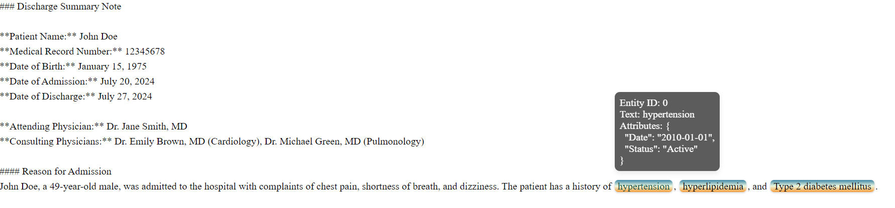

<div align="center"></div>


An LLM-powered tool that transforms everyday language into robust information extraction pipelines. 

| Features | Support |
|----------|----------|
| **LLM Agent for prompt writing** | :white_check_mark:  Interactive chat, Python functions |
| **Named Entity Recognition (NER)** | :white_check_mark: Document-level, Sentence-level |
| **Entity Attributes Extraction** | :white_check_mark: Flexible formats |
| **Relation Extraction (RE)** | :white_check_mark: Binary & Multiclass relations |

## Table of Contents
- [Overview](#overview)
- [Prerequisite](#prerequisite)
- [Installation](#installation)
- [Quick Start](#quick-start)
- [Examples](#examples)
- [User Guide](#user-guide)
    - [LLM Inference Engine](#llm-inference-engine)
    - [Prompt Template](#prompt-template)
    - [Prompt Editor](#prompt-editor)
    - [Extractor](#extractor)
        - [FrameExtractor](#frameextractor)
        - [RelationExtractor](#relationextractor)

## Overview
LLM-IE is a toolkit that provides robust information extraction utilities for named entity, entity attributes, and entity relation extraction. Since prompt design has a significant impact on generative information extraction with LLMs, it has a built-in LLM agent ("editor") to help with prompt writing. The flowchart below demonstrates the workflow starting from a casual language request to output visualization.

<div align="center"></div>

## Prerequisite
At least one LLM inference engine is required. There are built-in supports for 🦙 [Llama-cpp-python](https://github.com/abetlen/llama-cpp-python),  [Ollama](https://github.com/ollama/ollama), 🤗 [Huggingface_hub](https://github.com/huggingface/huggingface_hub),  [OpenAI API](https://platform.openai.com/docs/api-reference/introduction), and  [vLLM](https://github.com/vllm-project/vllm). For installation guides, please refer to those projects. Other inference engines can be configured through the [InferenceEngine](src/llm_ie/engines.py) abstract class. See [LLM Inference Engine](#llm-inference-engine) section below.

## Installation
The Python package is available on PyPI. 
```
pip install llm-ie 
```
Note that this package does not check LLM inference engine installation nor install them. See [prerequisite](#prerequisite) section for details. 

## Quick Start
We use a [synthesized medical note](demo/document/synthesized_note.txt) by ChatGPT to demo the information extraction process. Our task is to extract diagnosis names, spans, and corresponding attributes (i.e., diagnosis datetime, status).

#### Choose an LLM inference engine
Choose one of the built-in engines below.

<details>
<summary> Ollama</summary>

```python 
from llm_ie.engines import OllamaInferenceEngine

llm = OllamaInferenceEngine(model_name="llama3.1:8b-instruct-q8_0")
```
</details>
<details>
<summary>🦙 Llama-cpp-python</summary>

```python
from llm_ie.engines import LlamaCppInferenceEngine

llm = LlamaCppInferenceEngine(repo_id="bullerwins/Meta-Llama-3.1-8B-Instruct-GGUF",
                                    gguf_filename="Meta-Llama-3.1-8B-Instruct-Q8_0.gguf")
```
</details>

<details>
<summary>🤗 Huggingface_hub</summary>

```python
from llm_ie.engines import HuggingFaceHubInferenceEngine

llm = HuggingFaceHubInferenceEngine(model="meta-llama/Meta-Llama-3-8B-Instruct")
```
</details>

<details>
<summary> OpenAI API</summary>

Follow the [Best Practices for API Key Safety](https://help.openai.com/en/articles/5112595-best-practices-for-api-key-safety) to set up API key.
```python
from llm_ie.engines import OpenAIInferenceEngine

llm = OpenAIInferenceEngine(model="gpt-4o-mini")
```

</details>

<details>
<summary> vLLM</summary>

The vLLM support follows the [OpenAI Compatible Server](https://docs.vllm.ai/en/latest/serving/openai_compatible_server.html). For more parameters, please refer to the documentation.

Start the server
```cmd
vllm serve meta-llama/Meta-Llama-3.1-8B-Instruct
```
Define inference engine
```python
from llm_ie.engines import OpenAIInferenceEngine
engine = OpenAIInferenceEngine(base_url="http://localhost:8000/v1",
                               api_key="EMPTY",
                               model="meta-llama/Meta-Llama-3.1-8B-Instruct")
```


</details>

In this quick start demo, we use Llama-cpp-python to run Llama-3.1-8B with int8 quantization ([bullerwins/Meta-Llama-3.1-8B-Instruct-GGUF](https://huggingface.co/bullerwins/Meta-Llama-3.1-8B-Instruct-GGUF)). 
The outputs might be slightly different with other inference engines, LLMs, or quantization. 

#### Casual language as prompt 
We start with a casual description: 

*"Extract diagnosis from the clinical note. Make sure to include diagnosis date and status."* 

Define the AI prompt editor.
```python
from llm_ie.engines import OllamaInferenceEngine
from llm_ie.extractors import BasicFrameExtractor
from llm_ie.prompt_editor import PromptEditor

# Define a LLM inference engine
llm = OllamaInferenceEngine(model_name="llama3.1:8b-instruct-q8_0")
# Define LLM prompt editor
editor = PromptEditor(llm, BasicFrameExtractor)
# Start chat
editor.chat()
```

This opens an interactive session:
<div align="left"></div>


The ```PromptEditor``` drafts a prompt template following the schema required by the ```BasicFrameExtractor```:

```
# Task description
The paragraph below contains a clinical note with diagnoses listed. Please carefully review it and extract the diagnoses, including the diagnosis date and status.

# Schema definition
Your output should contain: 
    "Diagnosis" which is the name of the diagnosis,
    "Date" which is the date when the diagnosis was made,
    "Status" which is the current status of the diagnosis (e.g. active, resolved, etc.)

# Output format definition
Your output should follow JSON format, for example:
[
    {"Diagnosis": "<Diagnosis text>", "Date": "<date in YYYY-MM-DD format>", "Status": "<status>"},
    {"Diagnosis": "<Diagnosis text>", "Date": "<date in YYYY-MM-DD format>", "Status": "<status>"}
]

# Additional hints
Your output should be 100% based on the provided content. DO NOT output fake information.
If there is no specific date or status, just omit those keys.

# Input placeholder
Below is the clinical note:
{{input}}
```


#### Information extraction pipeline
Now we apply the prompt template to build an information extraction pipeline.

```python
# Load synthesized medical note
with open("./demo/document/synthesized_note.txt", 'r') as f:
    note_text = f.read()

# Define extractor
extractor = BasicFrameExtractor(llm, prompt_template)

# Extract
frames =  extractor.extract_frames(note_text, entity_key="Diagnosis", stream=True)

# Check extractions
for frame in frames:
    print(frame.to_dict())
```
The output is a list of frames. Each frame has a ```entity_text```, ```start```, ```end```, and a dictionary of ```attr```. 

```python
{'frame_id': '0', 'start': 537, 'end': 549, 'entity_text': 'Hypertension', 'attr': {'Datetime': '2010', 'Status': 'history'}}
{'frame_id': '1', 'start': 551, 'end': 565, 'entity_text': 'Hyperlipidemia', 'attr': {'Datetime': '2015', 'Status': 'history'}}
{'frame_id': '2', 'start': 571, 'end': 595, 'entity_text': 'Type 2 Diabetes Mellitus', 'attr': {'Datetime': '2018', 'Status': 'history'}}
{'frame_id': '3', 'start': 2402, 'end': 2431, 'entity_text': 'Acute Coronary Syndrome (ACS)', 'attr': {'Datetime': 'July 20, 2024', 'Status': 'present'}}
```

We can save the frames to a document object for better management. The document holds ```text``` and ```frames```. The ```add_frame()``` method performs validation and (if passed) adds a frame to the document.
The ```valid_mode``` controls how frame validation should be performed. For example, the ```valid_mode = "span"``` will prevent new frames from being added if the frame spans (```start```, ```end```) has already exist. The ```create_id = True``` allows the document to assign unique frame IDs.  

```python
from llm_ie.data_types import LLMInformationExtractionDocument

# Define document
doc = LLMInformationExtractionDocument(doc_id="Synthesized medical note",
                                       text=note_text)
# Add frames to a document
doc.add_frames(frames, create_id=True)

# Save document to file (.llmie)
doc.save("<your filename>.llmie")
```

To visualize the extracted frames, we use the ```viz_serve()``` method. 
```python
doc.viz_serve()
```
A Flask APP starts at port 5000 (default).
```
* Serving Flask app 'ie_viz.utilities'
* Debug mode: off
WARNING: This is a development server. Do not use it in a production deployment. Use a production WSGI server instead.
 * Running on all addresses (0.0.0.0)
 * Running on http://127.0.0.1:5000
Press CTRL+C to quit
127.0.0.1 - - [03/Oct/2024 23:36:22] "GET / HTTP/1.1" 200 -
```

<div align="left"></div>


## Examples
  - [Interactive chat with LLM prompt editors](demo/prompt_template_writing_via_chat.ipynb)
  - [Write prompt templates with LLM prompt editors](demo/prompt_template_writing.ipynb)
  - [NER + RE for Drug, Strength, Frequency](demo/medication_relation_extraction.ipynb)

## User Guide
This package is comprised of some key classes:
- LLM Inference Engine
- Prompt Template
- Prompt Editor
- Extractors

### LLM Inference Engine
Provides an interface for different LLM inference engines to work in the information extraction workflow. The built-in engines are ```LlamaCppInferenceEngine```, ```OllamaInferenceEngine```, and ```HuggingFaceHubInferenceEngine```. 

#### 🦙 Llama-cpp-python
The ```repo_id``` and ```gguf_filename``` must match the ones on the Huggingface repo to ensure the correct model is loaded. ```n_ctx``` determines the context length LLM will consider during text generation. Empirically, longer context length gives better performance, while consuming more memory and increases computation. Note that when ```n_ctx``` is less than the prompt length, Llama.cpp throws exceptions. ```n_gpu_layers``` indicates a number of model layers to offload to GPU. Default is -1 for all layers (entire LLM). Flash attention ```flash_attn``` is supported by Llama.cpp. The ```verbose``` indicates whether model information should be displayed. For more input parameters, see 🦙 [Llama-cpp-python](https://github.com/abetlen/llama-cpp-python). 

```python
from llm_ie.engines import LlamaCppInferenceEngine

llama_cpp = LlamaCppInferenceEngine(repo_id="bullerwins/Meta-Llama-3.1-8B-Instruct-GGUF",
                                    gguf_filename="Meta-Llama-3.1-8B-Instruct-Q8_0.gguf",
                                    n_ctx=4096,
                                    n_gpu_layers=-1,
                                    flash_attn=True,
                                    verbose=False)
```
####   Ollama
The ```model_name``` must match the names on the [Ollama library](https://ollama.com/library). Use the command line ```ollama ls``` to check your local model list. ```num_ctx``` determines the context length LLM will consider during text generation. Empirically, longer context length gives better performance, while consuming more memory and increases computation. ```keep_alive``` regulates the lifespan of LLM. It indicates a number of seconds to hold the LLM after the last API call. Default is 5 minutes (300 sec).

```python
from llm_ie.engines import OllamaInferenceEngine

ollama = OllamaInferenceEngine(model_name="llama3.1:8b-instruct-q8_0",
                               num_ctx=4096,
                               keep_alive=300)
```

#### 🤗 huggingface_hub
The ```model``` can be a model id hosted on the Hugging Face Hub or a URL to a deployed Inference Endpoint. Refer to the [Inference Client](https://huggingface.co/docs/huggingface_hub/en/package_reference/inference_client) documentation for more details. 

```python
from llm_ie.engines import HuggingFaceHubInferenceEngine

hf = HuggingFaceHubInferenceEngine(model="meta-llama/Meta-Llama-3-8B-Instruct")
```

####  OpenAI API
In bash, save API key to the environmental variable ```OPENAI_API_KEY```.
```
export OPENAI_API_KEY=<your_API_key>
```

In Python, create inference engine and specify model name. For the available models, refer to [OpenAI webpage](https://platform.openai.com/docs/models). 
For more parameters, see [OpenAI API reference](https://platform.openai.com/docs/api-reference/introduction).

```python
from llm_ie.engines import OpenAIInferenceEngine

openai_engine = OpenAIInferenceEngine(model="gpt-4o-mini")
```

####  vLLM
The vLLM support follows the [OpenAI Compatible Server](https://docs.vllm.ai/en/latest/serving/openai_compatible_server.html). For more parameters, please refer to the documentation.

Start the server
```cmd
CUDA_VISIBLE_DEVICES=<GPU#> vllm serve meta-llama/Meta-Llama-3.1-8B-Instruct --api-key MY_API_KEY --tensor-parallel-size <# of GPUs to use>
```
Use ```CUDA_VISIBLE_DEVICES``` to specify GPUs to use. The ```--tensor-parallel-size``` should be set accordingly. The ```--api-key``` is optional. 
the default port is 8000. ```--port``` sets the port. 

Define inference engine
```python
from llm_ie.engines import OpenAIInferenceEngine
engine = OpenAIInferenceEngine(base_url="http://localhost:8000/v1",
                               api_key="MY_API_KEY",
                               model="meta-llama/Meta-Llama-3.1-8B-Instruct")
```
The ```model``` must match the repo name specified in the server.

#### Test inference engine configuration
To test the inference engine, use the ```chat()``` method. 

```python
from llm_ie.engines import OllamaInferenceEngine

ollama = OllamaInferenceEngine(model_name="llama3.1:8b-instruct-q8_0")
engine.chat(messages=[{"role": "user", "content":"Hi"}], stream=True)
```
The output should be something like (might vary by LLMs and versions)

```python
'How can I help you today?'
```

#### Customize inference engine
The abstract class ```InferenceEngine``` defines the interface and required method ```chat()```. Inherit this class for customized API. 
```python
class InferenceEngine:
    @abc.abstractmethod
    def __init__(self):
        """
        This is an abstract class to provide interfaces for LLM inference engines. 
        Children classes that inherits this class can be used in extractors. Must implement chat() method.
        """
        return NotImplemented

    @abc.abstractmethod
    def chat(self, messages:List[Dict[str,str]], max_new_tokens:int=2048, temperature:float=0.0, stream:bool=False, **kwrs) -> str:
        """
        This method inputs chat messages and outputs LLM generated text.

        Parameters:
        ----------
        messages : List[Dict[str,str]]
            a list of dict with role and content. role must be one of {"system", "user", "assistant"}
        max_new_tokens : str, Optional
            the max number of new tokens LLM can generate. 
        temperature : float, Optional
            the temperature for token sampling. 
        stream : bool, Optional
            if True, LLM generated text will be printed in terminal in real-time. 
        """
        return NotImplemented
```

### Prompt Template
A prompt template is a string with one or many placeholders ``````. When input to an extractor, the ```text_content``` will be inserted into the placeholders to construct a prompt. Below is a demo:

```python
prompt_template = """
    Below is a medical note. Your task is to extract diagnosis information. 
    Your output should include: 
        "Diagnosis": extract diagnosis names, 
        "Datetime": date/ time of diagnosis, 
        "Status": status of present, history, or family history

    Your output should follow a JSON format:
    [
        {"Diagnosis": <exact words as in the document>, "Datetime": <diagnosis datetime>, "Status": <one of "present", "history">},
        {"Diagnosis": <exact words as in the document>, "Datetime": <diagnosis datetime>, "Status": <one of "present", "history">},
        ...
    ]

    Below is the medical note:
    "{{input}}"
"""
# Define a inference engine
ollama = OllamaInferenceEngine(model_name="llama3.1:8b-instruct-q8_0")

# Define an extractor 
extractor = BasicFrameExtractor(ollama, prompt_template)

# Apply text content to prompt template
prompt_text = extractor._get_user_prompt(text_content="<some text...>")
print(prompt_text)
```

The ```prompt_text``` is the text content filled in the placeholder spot. 

```
Below is a medical note. Your task is to extract diagnosis information. 
Your output should include: 
    "Diagnosis": extract diagnosis names, 
    "Datetime": date/ time of diagnosis, 
    "Status": status of present, history, or family history
Your output should follow a JSON format:
[
    {"Diagnosis": <exact words as in the document>, "Datetime": <diagnosis datetime>, "Status": <one of "present", "history">},
    {"Diagnosis": <exact words as in the document>, "Datetime": <diagnosis datetime>, "Status": <one of "present", "history">},
    ...
]
Below is the medical note:
"<some text...>"
```

#### Placeholder
When only one placeholder is defined in the prompt template, the ```text_content``` can be a string or a dictionary with one key (regardless of the key name). When multiple placeholders are defined in the prompt template, the ```text_content``` should be a dictionary with:

```python
{"<placeholder 1>": "<some text>", "<placeholder 2>": "<some text>"...}
```
For example,

```python
prompt_template = """
    Below is a medical note. Your task is to extract diagnosis information. 

    # Backgound knowledge
    {{knowledge}}
    Your output should include: 
        "Diagnosis": extract diagnosis names, 
        "Datetime": date/ time of diagnosis, 
        "Status": status of present, history, or family history

    Your output should follow a JSON format:
    [
        {"Diagnosis": <exact words as in the document>, "Datetime": <diagnosis datetime>, "Status": <one of "present", "history">},
        {"Diagnosis": <exact words as in the document>, "Datetime": <diagnosis datetime>, "Status": <one of "present", "history">},
        ...
    ]

    Below is the medical note:
    "{{note}}"
"""
ollama = OllamaInferenceEngine(model_name="llama3.1:8b-instruct-q8_0")
extractor = BasicFrameExtractor(ollama, prompt_template)
prompt_text = extractor._get_user_prompt(text_content={"knowledge": "<some text...>", 
                                                       "note": "<some text...>")
print(prompt_text)
```
Note that the keys in ```text_content``` must match the placeholder names defined in ```{{}}```.

#### Prompt writing guide
The quality of the prompt template can significantly impact the performance of information extraction. Also, the schema defined in prompt templates is dependent on the choice of extractors. When designing a prompt template schema, it is important to consider which extractor will be used. 

The ```Extractor``` class provides documentation and examples for prompt template writing. 

```python
from llm_ie.extractors import BasicFrameExtractor

print(BasicFrameExtractor.get_prompt_guide())
```

### Prompt Editor
The prompt editor is an LLM agent that help users write prompt templates following the defined schema and guideline of each extractor. Chat with the promtp editor:

```python
from llm_ie.prompt_editor import PromptEditor
from llm_ie.extractors import BasicFrameExtractor
from llm_ie.engines import OllamaInferenceEngine

# Define an LLM inference engine
ollama = OllamaInferenceEngine(model_name="llama3.1:8b-instruct-q8_0")

# Define editor
editor = PromptEditor(ollama, BasicFrameExtractor)

editor.chat()
```

In a terminal environment, an interactive chat session will start:
<div align="left"></div>

In the Jupyter/IPython environment, an ipywidgets session will start:
<div align="left"></div>


We can also use the `rewrite()` and `comment()` methods to programmingly interact with the prompt editor: 
1. start with a casual description of the task
2. have the prompt editor generate a prompt template as the starting point
3. manually revise the prompt template
4. have the prompt editor to comment/ rewrite it

```python
from llm_ie.prompt_editor import PromptEditor
from llm_ie.extractors import BasicFrameExtractor
from llm_ie.engines import OllamaInferenceEngine

# Define an LLM inference engine
ollama = OllamaInferenceEngine(model_name="llama3.1:8b-instruct-q8_0")

# Define editor
editor = PromptEditor(ollama, BasicFrameExtractor)

# Have editor to generate initial prompt template
initial_version = editor.rewrite("Extract treatment events from the discharge summary.")
print(initial_version)
```
The editor generated a ```initial_version``` as below:

```
# Task description
The paragraph below contains information about treatment events in a patient's discharge summary. Please carefully review it and extract the treatment events, including any relevant details such as medications or procedures. Note that each treatment event may be nested under a specific section of the discharge summary.

# Schema definition
Your output should contain: 
    "TreatmentEvent" which is the name of the treatment,
    If applicable, "Medication" which is the medication used for the treatment,
    If applicable, "Procedure" which is the procedure performed during the treatment,
    "Evidence" which is the EXACT sentence in the text where you found the TreatmentEvent from

# Output format definition
Your output should follow JSON format, for example:
[
    {"TreatmentEvent": "<Treatment event name>", "Medication": "<name of medication>", "Procedure": "<name of procedure>", "Evidence": "<exact sentence from the text>"},
    {"TreatmentEvent": "<Treatment event name>", "Medication": "<name of medication>", "Procedure": "<name of procedure>", "Evidence": "<exact sentence from the text>"} 
]

# Additional hints
Your output should be 100% based on the provided content. DO NOT output fake information.
If there is no specific medication or procedure, just omit the corresponding key.

# Input placeholder
Below is the discharge summary:
{{input}}
```
Manually reviewing it and thinking about our needs, we found certain issues:
1. The task description is not specific enough. This is expected since the editor does not have access to the real document. 
2. Depending on the project, we might not need evidence text. Outputing it consumes more output tokens. 

Therefore, we manually revised the prompt template as below:

```python
manually_revised = """
# Task description
The paragraph below is a patient's discharge summary. Please carefully review it and extract the treatment events, including any relevant details such as medications or procedures. Note that each treatment event may be nested under a specific section of the discharge summary.

# Schema definition
Your output should contain: 
    "TreatmentEvent" which is the name of the treatment,
    If applicable, "Medication" which is the medication used for the treatment,
    If applicable, "Procedure" which is the procedure performed during the treatment

# Output format definition
Your output should follow JSON format, for example:
[
    {"TreatmentEvent": "<Treatment event name>", "Medication": "<name of medication>", "Procedure": "<name of procedure>"},
    {"TreatmentEvent": "<Treatment event name>", "Medication": "<name of medication>", "Procedure": "<name of procedure>"} 
]

# Additional hints
Your output should be 100% based on the provided content. DO NOT output fake information.
If there is no specific medication or procedure, just omit the corresponding key.

# Input placeholder
Below is the discharge summary:
{{input}}
"""
```

Now we have the editor to comment our revision.

```python
comment = editor.comment(manually_revised)

print(comment)
```
The comments from the editor are:

```
Here's an analysis of the draft prompt based on the prompt guideline:

**1. Task description**: The task description is clear and concise, explaining that the goal is to extract treatment events from a patient's discharge summary.

**2. Schema definition**: The schema definition is well-defined, specifying three keys: "TreatmentEvent", "Medication", and "Procedure". However, it would be helpful to provide more context on what constitutes a "treatment event" and how to distinguish between medication and procedure information.

**3. Output format definition**: The output format is correctly specified as JSON, with an example provided for clarity.

**4. Additional hints**: The additional hints are clear and concise, emphasizing the importance of extracting only real information from the text and omitting fake data.

**5. Input placeholder**: The input placeholder is present, but it would be helpful to provide a more detailed description of what type of discharge summary is expected (e.g., medical history, treatment plan, etc.).

Overall, the draft prompt is well-structured and easy to follow. However, providing more context and clarity on certain aspects, such as the definition of "treatment event" and the distinction between medication and procedure information, would make it even more effective.

Rating: 8/10

Recommendations:

* Provide a more detailed description of what constitutes a "treatment event".
* Clarify how to distinguish between medication and procedure information.
* Consider adding an example of a discharge summary to help illustrate the task.
```

After a few iterations of revision, we will have a high-quality prompt template for the information extraction pipeline. 

### Extractor
An extractor implements a prompting method for information extraction. There are two extractor families: ```FrameExtractor``` and ```RelationExtractor```. 
The ```FrameExtractor``` extracts named entities and entity attributes ("frame"). The ```RelationExtractor``` extracts the relation (and relation types) between frames. 

#### FrameExtractor
The ```BasicFrameExtractor``` directly prompts LLM to generate a list of dictionaries. Each dictionary is then post-processed into a frame. The ```ReviewFrameExtractor``` is based on the ```BasicFrameExtractor``` but adds a review step after the initial extraction to boost sensitivity and improve performance. ```SentenceFrameExtractor``` gives LLM the entire document upfront as a reference, then prompts LLM sentence by sentence and collects per-sentence outputs. To learn about an extractor, use the class method ```get_prompt_guide()``` to print out the prompt guide. 

<details>
<summary>BasicFrameExtractor</summary>

The ```BasicFrameExtractor``` directly prompts LLM to generate a list of dictionaries. Each dictionary is then post-processed into a frame. The ```text_content``` holds the input text as a string, or as a dictionary (if prompt template has multiple input placeholders). The ```entity_key``` defines which JSON key should be used as entity text. It must be consistent with the prompt template. 

```python
from llm_ie.extractors import BasicFrameExtractor

extractor = BasicFrameExtractor(llm, prompt_temp)
frames = extractor.extract_frames(text_content=text, entity_key="Diagnosis", stream=True)
```

Use the ```get_prompt_guide()``` method to inspect the prompt template guideline for ```BasicFrameExtractor```. 

```python
from llm_ie.extractors import BasicFrameExtractor

print(BasicFrameExtractor.get_prompt_guide())
```

```
Prompt Template Design:

1. Task Description:  
   Provide a detailed description of the task, including the background and the type of task (e.g., named entity recognition).

2. Schema Definition:  
   List the key concepts that should be extracted, and provide clear definitions for each one.

3. Output Format Definition:  
   The output should be a JSON list, where each element is a dictionary representing a frame (an entity along with its attributes). Each dictionary must include a key that holds the entity text. This key can be named "entity_text" or anything else depend on the context. The attributes can either be flat (e.g., {"entity_text": "<entity_text>", "attr1": "<attr1>", "attr2": "<attr2>"}) or nested (e.g., {"entity_text": "<entity_text>", "attributes": {"attr1": "<attr1>", "attr2": "<attr2>"}}).

4. Optional: Hints:  
   Provide itemized hints for the information extractors to guide the extraction process.

5. Optional: Examples:  
   Include examples in the format:  
    Input: ...  
    Output: ...

6. Input Placeholder:  
   The template must include a placeholder in the format  for the input text. The placeholder name can be customized as needed.

......
```
</details>

<details>
<summary>ReviewFrameExtractor</summary>

The ```ReviewFrameExtractor``` is based on the ```BasicFrameExtractor``` but adds a review step after the initial extraction to boost sensitivity and improve performance. The ```review_prompt``` and ```review_mode``` are required when constructing the ```ReviewFrameExtractor```.

There are two review modes:
1. **Addition mode**: add more frames while keeping current. This is efficient for boosting recall. 
2. **Revision mode**: regenerate frames (add new and delete existing). 

Under the **Addition mode**, the ```review_prompt``` needs to instruct the LLM not to regenerate existing extractions:

*... You should ONLY add new diagnoses. DO NOT regenerate the entire answer.*

The ```review_mode``` should be set to ```review_mode="addition"```

Under the **Revision mode**, the ```review_prompt``` needs to instruct the LLM to regenerate:

*... Regenerate your output.*

The ```review_mode``` should be set to ```review_mode="revision"```

 ```python 
review_prompt = "Review the input and your output again. If you find some diagnosis was missed, add them to your output. Regenerate your output."

extractor = ReviewFrameExtractor(llm, prompt_temp, review_prompt, review_mode="revision")
frames = extractor.extract_frames(text_content=text, entity_key="Diagnosis", stream=True)
 ```
</details>

<details>
<summary>SentenceFrameExtractor</summary>

The ```SentenceFrameExtractor``` instructs the LLM to extract sentence by sentence. The reason is to ensure the accuracy of frame spans. It also prevents LLMs from overseeing sections/ sentences. Empirically, this extractor results in better recall than the ```BasicFrameExtractor``` in complex tasks. 

The ```multi_turn``` parameter specifies multi-turn conversation for prompting. If True, sentences and LLM outputs will be appended to the input message and carry-over. If False, only the current sentence is prompted. For LLM inference engines that supports prompt cache (e.g., Llama.Cpp, Ollama), use multi-turn conversation prompting can better utilize the KV caching and results in faster inferencing. But for vLLM with [Automatic Prefix Caching (APC)](https://docs.vllm.ai/en/latest/automatic_prefix_caching/apc.html), multi-turn conversation is not necessary.

```python
from llm_ie.extractors import SentenceFrameExtractor

extractor = SentenceFrameExtractor(llm, prompt_temp)
frames = extractor.extract_frames(text_content=text, entity_key="Diagnosis", multi_turn=True, stream=True)
```
</details>

#### RelationExtractor
Relation extractors prompt LLM with combinations of two frames from a document (```LLMInformationExtractionDocument```) and extract relations.
The ```BinaryRelationExtractor``` extracts binary relations (yes/no) between two frames. The ```MultiClassRelationExtractor``` extracts relations and assign relation types ("multi-class"). 

An important feature of the relation extractors is that users are required to define a ```possible_relation_func``` or ```possible_relation_types_func``` function for the extractors. The reason is, there are too many possible combinations of two frames (N choose 2 combinations). The ```possible_relation_func``` helps rule out impossible combinations and therefore, reduce the LLM inferencing burden.

<details>
<summary>BinaryRelationExtractor</summary>

Use the get_prompt_guide() method to inspect the prompt template guideline for BinaryRelationExtractor.
```python
from llm_ie.extractors import BinaryRelationExtractor

print(BinaryRelationExtractor.get_prompt_guide())
```

```
Prompt template design:
    1. Task description (mention binary relation extraction and ROI)
    2. Schema definition (defines relation)
    3. Output format definition (must use the key "Relation")
    4. Hints
    5. Input placeholders (must include "roi_text", "frame_1", and "frame_2" placeholders)


Example:

    # Task description
    This is a binary relation extraction task. Given a region of interest (ROI) text and two entities from a medical note, indicate the relation existence between the two entities.

    # Schema definition
        True: if there is a relationship between a medication name (one of the entities) and its strength or frequency (the other entity).
        False: Otherwise.

    # Output format definition
    Your output should follow the JSON format:
    {"Relation": "<True or False>"}

    I am only interested in the content between []. Do not explain your answer. 

    # Hints
        1. Your input always contains one medication entity and 1) one strength entity or 2) one frequency entity.
        2. Pay attention to the medication entity and see if the strength or frequency is for it.
        3. If the strength or frequency is for another medication, output False. 
        4. If the strength or frequency is for the same medication but at a different location (span), output False.

    # Input placeholders
    ROI Text with the two entities annotated with <entity_1> and <entity_2>:
    "{{roi_text}}"

    Entity 1 full information:
    {{frame_1}}

    Entity 2 full information:
    {{frame_2}}
```

As an example, we define the ```possible_relation_func``` function:
  - if the two frames are > 500 characters apart, we assume no relation (False)
  - if the two frames are "Medication" and "Strength", or "Medication" and "Frequency", there could be relations (True)

```python
def possible_relation_func(frame_1, frame_2) -> bool:
    """
    This function pre-process two frames and outputs a bool indicating whether the two frames could be related.
    """
    # if the distance between the two frames are > 500 characters, assume no relation.
    if abs(frame_1.start - frame_2.start) > 500:
        return False
    
    # if the entity types are "Medication" and "Strength", there could be relations.
    if (frame_1.attr["entity_type"] == "Medication" and frame_2.attr["entity_type"] == "Strength") or \
        (frame_2.attr["entity_type"] == "Medication" and frame_1.attr["entity_type"] == "Strength"):
        return True
    
    # if the entity types are "Medication" and "Frequency", there could be relations.
    if (frame_1.attr["entity_type"] == "Medication" and frame_2.attr["entity_type"] == "Frequency") or \
        (frame_2.attr["entity_type"] == "Medication" and frame_1.attr["entity_type"] == "Frequency"):
        return True

    # Otherwise, no relation.
    return False
```

In the ```BinaryRelationExtractor``` constructor, we pass in the prompt template and ```possible_relation_func```.

```python
from llm_ie.extractors import BinaryRelationExtractor

extractor = BinaryRelationExtractor(llm, prompt_template=prompt_template, possible_relation_func=possible_relation_func)
relations = extractor.extract_relations(doc, stream=True)
```

</details>


<details>
<summary>MultiClassRelationExtractor</summary>

The main difference from ```BinaryRelationExtractor``` is that the ```MultiClassRelationExtractor``` allows specifying relation types. The prompt template guideline has an additional placeholder for possible relation types ```{{pos_rel_types}}```. 

```python
print(MultiClassRelationExtractor.get_prompt_guide())
```

```
Prompt template design:
    1. Task description (mention multi-class relation extraction and ROI)
    2. Schema definition (defines relation types)
    3. Output format definition (must use the key "RelationType")
    4. Input placeholders (must include "roi_text", "frame_1", and "frame_2" placeholders)


Example:

    # Task description
    This is a multi-class relation extraction task. Given a region of interest (ROI) text and two frames from a medical note, classify the relation types between the two frames. 

    # Schema definition
        Strength-Drug: this is a relationship between the drug strength and its name. 
        Dosage-Drug: this is a relationship between the drug dosage and its name.
        Duration-Drug: this is a relationship between a drug duration and its name.
        Frequency-Drug: this is a relationship between a drug frequency and its name.
        Form-Drug: this is a relationship between a drug form and its name.
        Route-Drug: this is a relationship between the route of administration for a drug and its name.
        Reason-Drug: this is a relationship between the reason for which a drug was administered (e.g., symptoms, diseases, etc.) and a drug name.
        ADE-Drug: this is a relationship between an adverse drug event (ADE) and a drug name.

    # Output format definition
    Choose one of the relation types listed below or choose "No Relation":
    {{pos_rel_types}}

    Your output should follow the JSON format:
    {"RelationType": "<relation type or No Relation>"}

    I am only interested in the content between []. Do not explain your answer. 

    # Hints
        1. Your input always contains one medication entity and 1) one strength entity or 2) one frequency entity.
        2. Pay attention to the medication entity and see if the strength or frequency is for it.
        3. If the strength or frequency is for another medication, output "No Relation". 
        4. If the strength or frequency is for the same medication but at a different location (span), output "No Relation".

    # Input placeholders
    ROI Text with the two entities annotated with <entity_1> and <entity_2>:
    "{{roi_text}}"

    Entity 1 full information:
    {{frame_1}}

    Entity 2 full information:
    {{frame_2}}
```

As an example, we define the ```possible_relation_types_func``` :
  - if the two frames are > 500 characters apart, we assume "No Relation" (output [])
  - if the two frames are "Medication" and "Strength", the only possible relation types are "Strength-Drug" or "No Relation"
  - if the two frames are "Medication" and "Frequency", the only possible relation types are "Frequency-Drug" or "No Relation"

```python 
def possible_relation_types_func(frame_1, frame_2) -> List[str]:
    # If the two frames are > 500 characters apart, we assume "No Relation"
    if abs(frame_1.start - frame_2.start) > 500:
        return []
    
    # If the two frames are "Medication" and "Strength", the only possible relation types are "Strength-Drug" or "No Relation"
    if (frame_1.attr["entity_type"] == "Medication" and frame_2.attr["entity_type"] == "Strength") or \
        (frame_2.attr["entity_type"] == "Medication" and frame_1.attr["entity_type"] == "Strength"):
        return ['Strength-Drug']
    
    # If the two frames are "Medication" and "Frequency", the only possible relation types are "Frequency-Drug" or "No Relation"
    if (frame_1.attr["entity_type"] == "Medication" and frame_2.attr["entity_type"] == "Frequency") or \
        (frame_2.attr["entity_type"] == "Medication" and frame_1.attr["entity_type"] == "Frequency"):
        return ['Frequency-Drug']

    return []
```


```python
from llm_ie.extractors import MultiClassRelationExtractor

extractor = MultiClassRelationExtractor(llm, prompt_template=re_prompt_template, possible_relation_types_func=possible_relation_types_func)
relations = extractor.extract_relations(doc, stream=True)
```

</details>