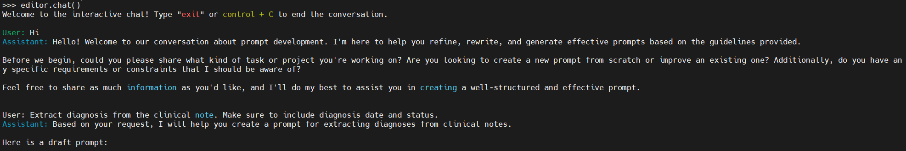

The prompt editor is an LLM agent that help users write prompt templates following the defined schema and guideline of each extractor. **It is recommanded to initiate prompt editors with larger/smarter LLMs for better quality!**. 

### Access Prompt Editor by chat interface
The easiest way to 

```python
from llm_ie import OllamaInferenceEngine, PromptEditor, DirectFrameExtractor

# Define an LLM inference engine
inference_engine = OllamaInferenceEngine(model_name="llama4:scout")

# Define editor
editor = PromptEditor(inference_engine, DirectFrameExtractor)

editor.chat()
```

In a terminal environment, an interactive chat session will start:


In the Jupyter/IPython environment, an ipywidgets session will start:


#### ⚠️Prompt Editor can make mistakes. Always check the output.
The Prompt Editor agent does not have access to documents that we are about to process unless included in the chat. Also, It does not have information about our purpose and backgournd of the request/project. Therefore, it is possible for Prompt Editor agent to propose suboptimal schema, provide incorrect examples, or generate irrelevant hints. It is very important that we check its output. It is a good practice to point out errors and ask Prompt Editor to revise it. Manual amendment is also recommended for minor issues. 

### Access Prompt Editor by Python functions
We can also use the `rewrite()` and `comment()` methods to programmingly interact with the prompt editor: 

1. start with a short description of the task
2. have the prompt editor generate a prompt template as a starting point
3. manually revise the prompt template
4. have the prompt editor to comment/ rewrite it

```python
from llm_ie import OllamaInferenceEngine, PromptEditor, DirectFrameExtractor

# Define an LLM inference engine
inference_engine = OllamaInferenceEngine(model_name="llama4:scout")

# Define editor
editor = PromptEditor(inference_engine, DirectFrameExtractor)

# Have editor to generate initial prompt template
initial_version = editor.rewrite("Extract treatment events from the discharge summary.")
print(initial_version)
```
