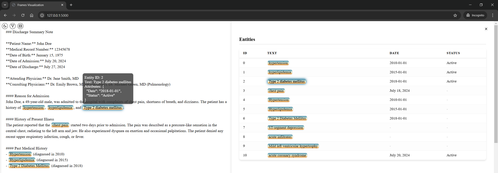

We use a synthesized medical note by ChatGPT to demo the information extraction process. Our task is to extract diagnosis names, spans, and corresponding attributes (i.e., diagnosis datetime, status).

<details>
<summary>Synthesized Clinical Note</summary>

```txt
### Discharge Summary Note

**Patient Name:** John Doe  
**Medical Record Number:** 12345678  
**Date of Birth:** January 15, 1975  
**Date of Admission:** July 20, 2024  
**Date of Discharge:** July 27, 2024  

**Attending Physician:** Dr. Jane Smith, MD  
**Consulting Physicians:** Dr. Emily Brown, MD (Cardiology), Dr. Michael Green, MD (Pulmonology)

#### Reason for Admission
John Doe, a 49-year-old male, was admitted to the hospital with complaints of chest pain, shortness of breath, and dizziness. The patient has a history of hypertension, hyperlipidemia, and Type 2 diabetes mellitus.

#### History of Present Illness
The patient reported that the chest pain started two days prior to admission. The pain was described as a pressure-like sensation in the central chest, radiating to the left arm and jaw. He also experienced dyspnea on exertion and occasional palpitations. The patient denied any recent upper respiratory infection, cough, or fever.

#### Past Medical History
- Hypertension (diagnosed in 2010)
- Hyperlipidemia (diagnosed in 2015)
- Type 2 Diabetes Mellitus (diagnosed in 2018)

#### Social History
- Former smoker (quit in 2010)
- Occasional alcohol consumption
- Works as an accountant
- Married with two children

#### Family History
- Father: myocardial infarction at age 55
- Mother: Type 2 diabetes mellitus

#### Physical Examination
- **Vital Signs:** Blood pressure 160/95 mmHg, heart rate 88 bpm, respiratory rate 20 breaths/min, temperature 98.6°F, oxygen saturation 96% on room air.
- **General:** Alert and oriented, in mild distress.
- **Cardiovascular:** Regular rhythm, no murmurs, rubs, or gallops. Jugular venous pressure not elevated.
- **Respiratory:** Clear to auscultation bilaterally, no wheezes, rales, or rhonchi.
- **Abdomen:** Soft, non-tender, no hepatosplenomegaly.
- **Extremities:** No edema, pulses 2+ bilaterally.

#### Laboratory and Diagnostic Tests
- **EKG:** ST-segment depression in leads V4-V6.
- **Troponin I:** Elevated at 0.15 ng/mL (normal <0.04 ng/mL).
- **Chest X-ray:** No acute infiltrates, normal cardiac silhouette.
- **Echocardiogram:** Mild left ventricular hypertrophy, ejection fraction 55%.
- **CBC:** WBC 8.5 x 10^3/uL, Hgb 13.5 g/dL, Platelets 250 x 10^3/uL.
- **CMP:** Na 138 mmol/L, K 4.0 mmol/L, BUN 15 mg/dL, Creatinine 0.9 mg/dL, Glucose 180 mg/dL, HbA1c 7.8%.

#### Hospital Course
John Doe was diagnosed with acute coronary syndrome (ACS). He was started on dual antiplatelet therapy with aspirin and clopidogrel, along with high-dose atorvastatin, and a beta-blocker. A cardiology consultation was obtained, and the patient underwent coronary angiography, which revealed a 70% stenosis in the left anterior descending artery. A drug-eluting stent was placed successfully.

Post-procedure, the patient was monitored in the coronary care unit. He remained hemodynamically stable, with no recurrent chest pain. He was gradually advanced to a regular cardiac diet and was ambulating without difficulty by day three of hospitalization. Diabetes management was optimized with the addition of metformin, and his blood pressure was controlled with the continuation of his antihypertensive regimen.

#### Discharge Medications
- Aspirin 81 mg daily
- Clopidogrel 75 mg daily
- Atorvastatin 40 mg daily
- Metoprolol 50 mg twice daily
- Lisinopril 20 mg daily
- Metformin 1000 mg twice daily

#### Discharge Instructions
John Doe was advised to follow a heart-healthy diet, engage in regular physical activity, and monitor his blood glucose levels. He was instructed to avoid smoking and limit alcohol intake. Follow-up appointments were scheduled with his primary care physician, cardiologist, and endocrinologist.

The patient was educated on the signs and symptoms of recurrent chest pain and instructed to seek immediate medical attention if they occur. He was provided with a prescription for a nitroglycerin tablet to use as needed for chest pain.

#### Follow-Up Appointments
- Primary Care Physician: August 3, 2024
- Cardiology: August 10, 2024
- Endocrinology: August 17, 2024

**Discharge Summary Prepared by:**  
Dr. Jane Smith, MD  
July 27, 2024
```

</details>

### Choose an LLM inference engine
*LLM-IE* works with both **local** and **remote** LLM deployments. In this quick start demo, we use OpenRouter to run [Llama-4-Scout](https://huggingface.co/meta-llama/Llama-4-Scout-17B-16E) for prompt engineering and [Llama-3.1-70B-Instruct](https://huggingface.co/meta-llama/Llama-3.1-70B-Instruct) for entity and attribute extraction.
The outputs might be slightly different with other inference engines, LLMs, or quantization. To use other inference engines (e.g., Ollama, Huggingface Hub) and models (e.g., GPT-4o, Qwen3), see [LLM Inference Engine](./llm_inference_engine.md) and [LLM Configuration](./llm_config.md).

### Prompt engineering by chatting with LLM agent
We start with defining prompt editor LLM agent. We store OpenRouter API key in environmental variable `OPENROUTER_API_KEY`.
```bash
export OPENROUTER_API_KEY=<OpenRouter API key>
```

```python
from llm_ie import OpenAIInferenceEngine, BasicLLMConfig, DirectFrameExtractor, PromptEditor, SentenceUnitChunker, SlideWindowContextChunker

# Define a LLM inference engine for the prompt editor
prompt_editor_llm = OpenAIInferenceEngine(base_url="https://openrouter.ai/api/v1", 
                                          model="meta-llama/llama-4-scout", 
                                          api_key=os.getenv("OPENROUTER_API_KEY"),
                                          config=BasicLLMConfig(temperature=0.4, 
                                                                max_new_tokens=4096))
# Define LLM prompt editor
editor = PromptEditor(prompt_editor_llm, DirectFrameExtractor)
# Start chat
editor.chat()
```

This opens an interactive session where we can chat with the [Prompt Editor](./prompt_editor.md) agent:


The agent drafts a [prompt template](./prompt_templates.md) following the schema required by the ```DirectFrameExtractor```.
After a few rounds of chatting, we have a prompt template to start with:
```text
### Task description
The paragraph below contains a clinical note with diagnoses listed. Please carefully review it and extract the diagnoses, including the diagnosis date and status.

### Schema definition
Your output should contain: 
    "entity_text" which is the diagnosis spelled as it appears in the text,
    "Date" which is the date when the diagnosis was made,
    "Status" which is the current status of the diagnosis (e.g. active, resolved, etc.)

### Output format definition
Your output should follow JSON format, for example:
[
    {"entity_text": "<Diagnosis>", "attr": {"Date": "<date in YYYY-MM-DD format>", "Status": "<status>"}},
    {"entity_text": "<Diagnosis>", "attr": {"Date": "<date in YYYY-MM-DD format>", "Status": "<status>"}}
]

### Additional hints
- Your output should be 100% based on the provided content. DO NOT output fake information.
- If there is no specific date or status, just omit those keys.

### Context
The text below is from the clinical note:
"{{input}}"
```

### Design prompting algorithm for information extraction
Instead of prompting LLMs with the entire document (which, by our experiments, has worse performance), we divide the input document into units (e.g., sentences, text lines, paragraphs). LLM only focus on one unit at a time, before moving to the next unit. This is achieved by the `UnitChunker` classes. In this demo, we use `SentenceUnitChunker` for sentence-by-sentence prompting. LLM only focus on one sentence at a time. We supply a context, in this case, a slide window of 2 sentences as context. This provides LLM with additional information. This is achieved by the `SlideWindowContextChunker` class. To learn more about prompting algorithm, see [Extractors](./extractors.md). For information extraction, we use a smaller LLM, llama-3.1-70b-instruct for lower cost. We set `temperature = 0.0` to improve output stability and reproducibility. 

```python
# Load synthesized medical note
with open("./demo/document/synthesized_note.txt", 'r') as f:
    note_text = f.read()

# Define a LLM inference engine for the extractor
extractor_llm = OpenAIInferenceEngine(base_url="https://openrouter.ai/api/v1", 
                                      model="meta-llama/llama-3.1-70b-instruct", 
                                      api_key=os.getenv("OPENROUTER_API_KEY"),
                                      config=BasicLLMConfig(temperature=0.0, 
                                                            max_new_tokens=1024))
# Define unit chunker. Prompts sentences-by-sentence.
unit_chunker = SentenceUnitChunker()
# Define context chunker. Provides context for units.
context_chunker = SlideWindowContextChunker(window_size=2)
# Define extractor
extractor = DirectFrameExtractor(inference_engine=extractor_llm, 
                                 unit_chunker=unit_chunker,
                                 context_chunker=context_chunker,
                                 prompt_template=prompt_template)
```

To run the frame extraction, use `extract_frames` method. A list of entities with attributes ("frames") will be returned. Concurrent processing is supported by setting `concurrent=True`.
```python
# To stream the extraction process, use concurrent=False, stream=True:
frames =  extractor.extract_frames(note_text, concurrent=False, verbose=True)
# For faster extraction, use concurrent=True to enable asynchronous prompting
# frames =  extractor.extract_frames(note_text, concurrent=True)

# Check extractions
for frame in frames:
    print(frame.to_dict())
```
The output is a list of frames. Each frame has a `entity_text`, `start`, `end`, and a dictionary of `attr`. 

```python
{'frame_id': '0', 'start': 537, 'end': 549, 'entity_text': 'hypertension', 'attr': {'Status': ''}}
{'frame_id': '1', 'start': 551, 'end': 565, 'entity_text': 'hyperlipidemia', 'attr': {'Status': ''}}
{'frame_id': '2', 'start': 571, 'end': 595, 'entity_text': 'Type 2 diabetes mellitus', 'attr': {'Status': ''}}
{'frame_id': '3', 'start': 991, 'end': 1003, 'entity_text': 'Hypertension', 'attr': {'Date': '2010', 'Status': None}}
{'frame_id': '4', 'start': 1026, 'end': 1040, 'entity_text': 'Hyperlipidemia', 'attr': {'Date': '2015', 'Status': None}}
{'frame_id': '5', 'start': 1063, 'end': 1087, 'entity_text': 'Type 2 Diabetes Mellitus', 'attr': {'Date': '2018', 'Status': None}}
{'frame_id': '6', 'start': 1646, 'end': 1682, 'entity_text': 'Jugular venous pressure not elevated', 'attr': {}}
{'frame_id': '7', 'start': 1703, 'end': 1767, 'entity_text': 'Clear to auscultation bilaterally, no wheezes, rales, or rhonchi', 'attr': {}}
{'frame_id': '8', 'start': 1802, 'end': 1823, 'entity_text': 'no hepatosplenomegaly', 'attr': {}}
{'frame_id': '9', 'start': 1926, 'end': 1962, 'entity_text': 'ST-segment depression in leads V4-V6', 'attr': {}}
{'frame_id': '10', 'start': 1982, 'end': 2004, 'entity_text': 'Elevated at 0.15 ng/mL', 'attr': {'Date': '', 'Status': ''}}
{'frame_id': '11', 'start': 2046, 'end': 2066, 'entity_text': 'No acute infiltrates', 'attr': {}}
{'frame_id': '12', 'start': 2068, 'end': 2093, 'entity_text': 'normal cardiac silhouette', 'attr': {}}
{'frame_id': '13', 'start': 2117, 'end': 2150, 'entity_text': 'Mild left ventricular hypertrophy', 'attr': {'Date': '', 'Status': ''}}
{'frame_id': '14', 'start': 2321, 'end': 2338, 'entity_text': 'Glucose 180 mg/dL', 'attr': {}}
{'frame_id': '15', 'start': 2340, 'end': 2350, 'entity_text': 'HbA1c 7.8%', 'attr': {}}
{'frame_id': '16', 'start': 2402, 'end': 2431, 'entity_text': 'acute coronary syndrome (ACS)', 'attr': {'Date': None, 'Status': None}}
{'frame_id': '17', 'start': 3025, 'end': 3033, 'entity_text': 'Diabetes', 'attr': {}}
{'frame_id': '18', 'start': 3925, 'end': 3935, 'entity_text': 'chest pain', 'attr': {'Date': '', 'Status': ''}}
```

### Data management and visualization
We can save the frames to a document object for better management. The document holds `text` and `frames`. The `add_frame()` method performs validation and (if passed) adds a frame to the document.
The `valid_mode` controls how frame validation should be performed. For example, the `valid_mode = "span"` will prevent new frames from being added if the frame spans (`start`, `end`) has already exist. The `create_id = True` allows the document to assign unique frame IDs.  

```python
from llm_ie.data_types import LLMInformationExtractionDocument

# Define document
doc = LLMInformationExtractionDocument(doc_id="Synthesized medical note",
                                       text=note_text)
# Add frames to a document
doc.add_frames(frames, create_id=True)

# Save document to file (.llmie)
doc.save("<your filename>.llmie")
```

To visualize the extracted frames, we use the ```viz_serve()``` method. 
```python
doc.viz_serve()
```
A Flask App starts at port 5000 (default). To learn more about visualization, see [Visualization](./visualization.md).

