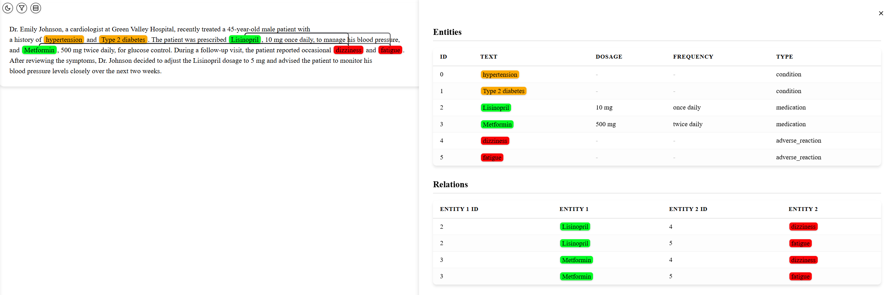

The `LLMInformationExtractionDocument` class supports named entity, entity attributes, and relation visualization. The implementation is through our plug-in package [ie-viz](https://github.com/daviden1013/ie-viz). 

```cmd
pip install ie-viz
```

The `viz_serve()` method starts a Flask App on localhost port 5000 by default. 
```python
from llm_ie.data_types import LLMInformationExtractionDocument

# Define document
doc = LLMInformationExtractionDocument(doc_id="Medical note",
                                       text=note_text)
# Add extracted frames and relations to document
doc.add_frames(frames)
doc.add_relations(relations)
# Visualize the document
doc.viz_serve()
```



Alternatively, the `viz_render()` method returns a self-contained (HTML + JS + CSS) string. Save it to file and open with a browser.
```python
html = doc.viz_render()

with open("Medical note.html", "w") as f:
    f.write(html)
```

To customize colors for different entities, use `color_attr_key` (simple) or `color_map_func` (advanced). 

The `color_attr_key` automatically assign colors based on the specified attribute key. For example, "EntityType".
```python
doc.viz_serve(color_attr_key="EntityType")
```

The `color_map_func` allow users to define a custom entity-color mapping function. For example,
```python
def color_map_func(entity) -> str:
    if entity['attr']['<attribute key>'] == "<a certain value>":
        return "#7f7f7f"
    else:
        return "#03A9F4"

doc.viz_serve(color_map_func=color_map_func)
```