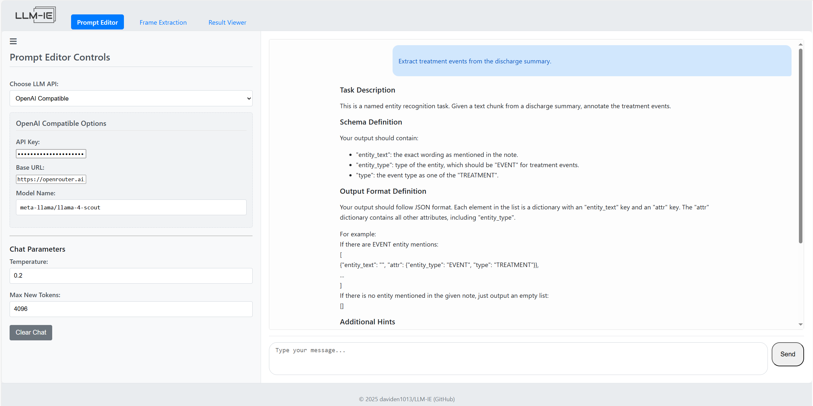

We provide a drag-and-drop web Application for no-code access to the *LLM-IE*. The web Application streamlines the workflow:

1. Prompt engineering with LLM agent: [Prompt Editor Tab](#prompt-editor-tab)
2. Prompting algorithm design: [Frame extraction Tab](#frame-extraction-tab)
3. Visualization & Validation: [Result viewer Tab](#result-viewer-tab)
4. Repeat step #1-#3 until achieves high accuracy

## Installation
The image is available on Docker Hub. Use the command below to pull and run locally:
```bash
docker pull daviden1013/llm-ie-web-app:latest
docker run -p 5000:5000 daviden1013/llm-ie-web-app:latest
```

## Prompt Editor Tab
- #### Select an inference API 
Select from the dropdown (e.g., OpenAI, Azure, Ollama, Huggingface Hub) and specify an LLM. It is recomanded to select larger/smarter LLMs for better performance. Supply the API key, base URL, and deployment (for Azure) if needed. 

- #### Start chatting
Describe your task and the Prompt Editor LLM agent behind the scene will help construct a structured prompt template. Feel free to ask the Prompt Editor questions, request it to revise, or ask it to add examples. 



## Frame Extraction Tab
- #### Select an inference API 
Select an inferencing API and specify an LLM. This model will perform the frame extraction task, so keep the balance of cost and performance in mind. If you have a lot of document to process, the API calls/cost can be high! 

- #### Paste your document and prompt temlpate
In the "Input Text" textbox, paste the document text that you want to process. In the "Prompt Template" textbox, paste the prompt template you obtained from the previous step [Prompt Editor Tab](#prompt-editor-tab).

- #### Select a chunking method
Frame extraction adopts an **unit-context schema**. The purpose is to avoid having LLM to process long context and suffer from *needle in the haystack* challenge. We split an input document into multiple units. LLM only process a unit of text at a time. 

- **Unit:** a text snippet that LLM extrator will process at a time. It could be a sentence, a line of text, or a paragraph. 
- **Context:** the context around the unit. For exapmle, a slidewindow of 2 sentences before and after. Context is optional. 

See more details in [Extractors](./extractors.md)

- #### Watch the extraction process
Click on the "Start Extraction" button and watch LLM processes unit-by-unit on the right panel. It is recommanded to monitor the process and look for errors.

- #### Download results
Use the download button on the top-right to download results. The resulting JSON will be saved as a `.llmie` file to your download folder. 


## Result Viewer Tab
- #### Upload the result `.llmie` file.
Drop the result file from the previous step [Frame extraction Tab](#frame-extraction-tab) to upload. 

- #### Select color key (Optional)
Optionally, select the attribute key in the dropdown for color coding.

